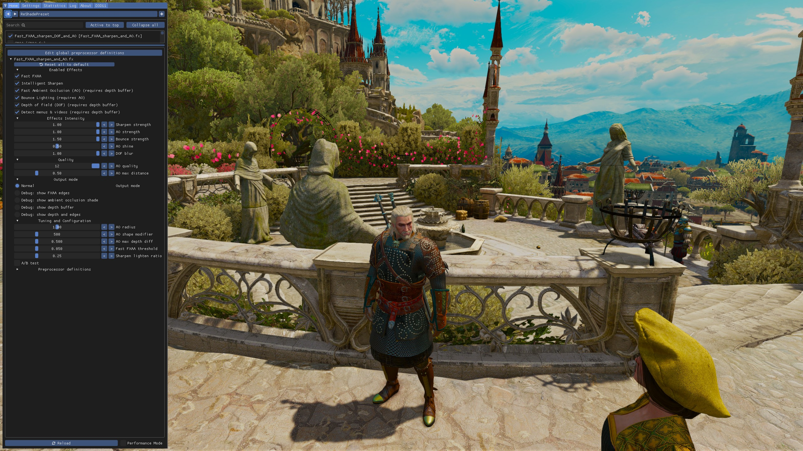

Fast_FXAA_sharpen_DOF_and_AO (version 1.0)
======================================

Author: Robert Jessop

License: MIT
	
Copyright 2021 Robert Jessop

About
-----
	
Designed for speed, this shader for ReShade is for people who can't just run everything at max settings and want good enough post-processing without costing too much framerate. The FXAA quite a bit faster than as standard FXAA, and ambient occlusion more than twice as fast as other algorithms.
	
It combines 4 effects in one shader for speed. Each can be enabled or disabled.
	
1. Fast FXAA (fullscreen approximate anti-aliasing). Fixes jagged edges. Almost twice as fast as normal FXAA, and it preserves fine details and GUI elements a bit better. However, long edges very close to horizontal or vertical aren't fixed quite so smoothly.
2. Intelligent Sharpening. Improves clarity of texture details.
3. Subtle Depth of Field. Softens distant objects. A sharpened background can distract from the foreground action; softening the background can make the image feel more real too. 
4. Fast ambient occlusion. Shades concave areas that would receive less scattered ambient light. This is faster than typical implementations (e.g. SSAO, HBAO+). The algorithm gives surprisingly good quality with few sample points. It's designed for speed, not perfection - for highest possible quality you might want to try the game's built-in AO options, or a different ReShade shader instead. It has an optional "bounce lighting" mode, which blends in the reflected colour from a nearby surface. There is also the option, AO shine, for it to highlight convex areas, which can make images more vivid, adds depth, and prevents the image overall becoming too dark.
	
3 and 4 require depth buffer access.

Tested in Toussaint :)

	
Setup
-----
	
1. Install ReShade and configure it for your game (See https://reshade.me)
2. Copy Fast_FXAA_sharpen_DOF_and_AO.fx to ReShade's Shaders folder within the game's folder (e.g. C:\Program Files (x86)\Steam\steamapps\common\The Witcher 3\bin\x64\reshade-shaders\Shaders)
3. Run the game
4. Turn off the game's own FXAA, sharpen, depth of field & AO/SSAO/HBAO options (if it has them).
	- Some games do not have individual options, but have a single "post-processing" setting. Setting that to the lowest value will probably disable them all.
5. Call up ReShade's interface in game and enable Fast_FXAA_sharpen_DOF_and_AO
6. Check if depth buffer is working and set up correctly. If not, disable the Depth of field and Ambient Occlusion effects for a small performance improvement. 
	- Check ReShade's supported games list to see any notes about depth buffer first. 
	- Check in-game (playing, not in a menu or video cutscene):
	- Use the built-in "Debug: show depth buffer" to check it's there and "Debug: show depth and FXAA edges" to check it's aligned.		
	- Close objects should be black and distant ones white. It should align with shapes in the image.
		* If it looks different it may need configuration - Use ReShade's DisplayDepth shader to help find and set the right "global preprocessor definitions" to fix the depth buffer.
			- If you get no depth image, set Depth of Field, Ambient Occlusion and Detect Menus to off, as they won't work.	
7. (Optional) Adjust based on personal preference and what works best & looks good in the game. 
	- Note: turn off "performance mode" in Reshade (bottom of panel) to configure, Turn it on when you're happy with the configuration.  
		
Enabled/disable effects
-----------------------
	
**Fast FXAA** - Fullscreen approximate anti-aliasing. Fixes jagged edges.

**Intelligent Sharpen** - Sharpens details but not straight edges (avoiding artefacts). It works with FXAA and depth of field instead of fighting them. It darkens pixels more than it brightens them; this looks more realistic.

**Fast Ambient Occlusion (AO) (requires depth buffer)** - Ambient occlusion shades pixels that are surrounded by pixels closer to the camera - concave shapes. It's a simple approximation of the of ambient light reaching each area (i.e. light just bouncing around the world, not direct light.)

**Bounce Lighting (requires AO)** - Approximates local ambient light colour. A bright red pillar by a white wall will make the wall a bit red. Makes Ambient Occlusion use two samples of colour data as well as depth. Fast Ambient Occlusion must be enabled too.

**Depth of Field (DOF) (requires depth buffer)** - Softens distant objects subtly, as if slightly out of focus. 

**Detect menus & videos (requires depth buffer)** - Skip all processing if depth value is 0 or 1 (per pixel). Full-screen videos and 2D menus probably do not need anti-aliasing nor sharpenning, and may lose worse with them. Only enable if depth buffer always available in gameplay!
    

Effects Intensity
-----------------

**Sharpen strength** - For high values I suggest depth of field too.

**AO strength** - Ambient Occlusion. Higher mean deeper shade in concave areas.

**Bounce strength** - Multiplier for local bounced light. A bright red pillar by a white wall will make the wall a bit red, but how red? 

**AO shine** - Normally AO just adds shade; with this it also brightens convex shapes. Maybe not realistic, but it prevents the image overall becoming too dark, makes it more vivid, and makes some corners clearer. 

**DOF blur** - Depth of field. Applies subtle smoothing to distant objects. If zero it just cancels out sharpening on far objects. It's a small effect (1 pixel radius).

Quality
-------

**AO quality** - Ambient Occlusion. Number of sample points. The is your speed vs quality knob; higher is better but slower. TIP: Hit reload button after changing this (performance bug workaround).

**AO max distance** - The ambient occlusion effect fades until it is zero at this distance. Helps avoid avoid artefacts if the game uses fog or haze. If you see deep shadows in the clouds then reduce this. If the game has long, clear views then increase it.

Output mode
-----------

**Normal** - Normal output

**Debug: show FXAA edges** - Highlights edges that are being smoothed by FXAA. The brighter green the more smoothing is applied. Don't worry if moderate smoothing appears where you don't think it should - sharpening will compensate.

**Debug: show ambient occlusion shade** - Shows amount of shading AO is applying against a grey background. Use this if tweaking AO settings to help get them just right see the effect of each setting clearly. However, don't worry if it doesn't look perfect - it exaggerates the effect and many issues won't be noticable in the final image. The best final check after changing settings is to go back to normal but with AO strength at max.

**Debug: show depth buffer** - This image shows the distance to each pixel. However not all games provide it and there are a few different formats they can use. Use to check if it works and is in the correct format. Close objects should be black and distant ones white. If it looks different it may need configuration - Use ReShade's DisplayDepth shader to help find and set the right "global preprocessor definitions" to fix the depth buffer. If you get no depth image, set Depth of Field, Ambient Occlusion and Detect Menus to off, as they won't work.		

**Debug: show depth and edges** - Shows depth buffer and highlights edges - it helps you check if depth buffer is correctly aligned with the image. Some games (e.g. Journey) do weird things that mean it's offset and tweaking ReShade's depth buffer settings might be required. It's as if you can see the Matrix.

Tuning and Configuration
------------------------

**AO radius** - Ambient Occlusion area size, as percent of screen. Bigger means larger areas of shade, but too big and you lose detail in the shade around small objects. Bigger can be slower too. 	
		
**AO shape modifier** - Ambient occlusion - weight against shading flat areas. Increase if you get deep shade in almost flat areas. Decrease if you get no-shade in concave areas areas that are shallow, but deep enough that they should be occluded. 
	
**AO max depth diff** - Ambient occlusion biggest depth difference to allow, as percent of depth. Prevents nearby objects casting shade on distant objects. Decrease if you get dark halos around objects. Increase if holes that should be shaded are not.
	
**Fast FXAA threshold** - Shouldn't need to change this. Smoothing starts when the step shape is stronger than this. Too high and some steps will be visible. Too low and subtle textures will lose detail.
	
**Sharpen lighten ratio** - Sharpening looks most realistic if highlights are weaker than shade. The change in colour is multiplied by this if it's getting brighter.

Tips
----

- Check if game provides depth buffer! If not turn of depth of field, ambient occlusion and detect menus for better performance (they won't affect the image if left on by mistake).
- Bounce lighting is off by default because it makes AO twice as slow, and is slightly more likely to have artefacts due to low sample count. However, most of the time it really makes shading look more realistic so turn it on if you can spare 2 fps.
- If depth is always available during gameplay then enabling Detect menus and videos is recommended to make non-gamplay parts clearer. 
- If the game uses lots of dithering (i.e. ░▒▓ patterns), sharpen may exagerate it, so use less sharpenning. (e.g. Witcher 2's lighting & shadows.)		
- If you don't like an effect then reduce it or turn it off. Disabling effects improves performance, except sharpening, which is basically free if FXAA or depth of field is on.	
- If the game uses lots of semi-transparent effects like smoke or fog, and you get incorrect shadows/silluettes then you may need to tweak AO max distance. Alternatively, you could use the game's own slower SSAO option if it has one. This is a limitation of ReShade and similar tools, ambient occlusion should be drawn before transparent objects, but ReShade can only work with the output of the game and apply it afterwards.
- You can mix and match with in-game options or other ReShade shaders, though you lose some the performance benefits of a combined shader.
- The maximum AO Quality is 12 normally, but it is limited to 8 in DirectX 9 games (due to a shader complexity limit in DirectX 9). Workaround: you can set a higher number by adding AO_POINTS to ReShade's global preprocessor definitions - this helps DirectX compile smaller code that doesn't have to support multiple quality levels.
	* One could set AO_POINTS higher than 12 but it's not worth it - the algorithm is designed for few points and won't use the extra points wisely.
- Experiment!
	* How much sharpen and depth of field is really a matter of personal taste. 
	* Don't be afraid to try lower AO quality levels if you want maximum performance. Even a little bit of AO can make the image look less flat.
	* Be careful with ambient occlusion settings; what looks good in one scene may be too much in another. Try to test changes in different areas of the game with different fog and light levels. It looks cool at the maximum but is it realistic? Less can be more; even a tiny bit of AO makes everything look more three-dimensional.
		
Benchmark
---------
- Game: Witcher 3 
- Scene: [Beauclair looking at the water feature opposite the bank](/Comparison%20Screenshots%20Witcher%203/Benchmark%20Location.png) 
- Settings: 1080p, Graphics settings low
- Hardware: Razer Blade Stealth 13 Late 2019 Laptop with NVIDIA GeForce GTX 1650 with Max-Q design

**Baseline**

	FPS	Settings
	86	No post-processing

**Fast_FXAA_sharpen_DOF_and_AO results**

	FPS	Settings
	82	default (Fast FXAA + sharpen + Fast AO + bounce + DOF)
	84	Fast FXAA only
	84	Fast FXAA + sharpen
	83	Fast AO only
	82	Fast AO only, quality 12
	83	Fast AO + bounce
	81	Fast AO + bounce, quality 12
	80	All max, quality 12

**Witcher 3 builtin post-processing**

	FPS	Settings
	83	Anti-Aliasing
	82	Anti-Aliasing, sharpening
	79	SSAO
	74	Anti-Aliasing, sharpening, SSAO
	72	HBAO+
	68	Anti-Aliasing, sharpening, HBAO+

**Comparison to other Reshade shaders**

SMAA and FXAA are anti-aliasing. MXAO and SSDO and ambient occlusion.

	FPS	Shader and settings
	81	SMAA
	82	FXAA
	75	MXAO very low (4 samples)
	71	MXAO default (16 samples)
	69	MXAO default plus MXAO_ENABLE_IL on
	68	PPFX SSDO
	67	FXAA + MXAO (default quality)
	64	FXAA + PPFX SSDO

Similar results (relatively) are seen in other locations and graphic settings and resolutions.
	
Tech details
------------
	
Combining FXAA, sharpening and depth of field in one shader works better than separate ones because the algorithms work together. Each pixel is sharpened or softened only once, and where FXAA detects strong edges they're not sharpened. With seperate shaders sometimes sharpening can undo some of the good work of FXAA. More importantly, it's much faster because we only read the pixels only once.
	
GPUs are so fast that memory is the performance bottleneck. While developing I found that number of texture reads was the biggest factor in performance. Interestingly, it's the same if you're reading one texel, or the bilinear interpolation of 4 adjacent ones (interpolation is implemented in hardware such that it is basically free). Each pass has noticable cost too. Therefore everything is combined in one pass, with the algorithms designed to use as few reads as possible. Fast FXAA makes 7 reads per pixel. Sharpen uses 5 reads, but 5 already read by FXAA so if both are enabled it's basically free. Depth of field also re-uses the same 5 pixels, but adds a read from the depth buffer. Ambient occlusion adds 3-9 more depth buffer reads (depending on quality level set). 
	
FXAA starts with the centre pixel, plus 4 samples each half a pixel away diagonally; each of the 4 samples is the average of four pixels. Based on their shape it then samples two more points 3.5 pixels away horizontally or vertically. We look at the diamond created ◊ and look at the change along each side of the diamond. If the change is bigger on one pair of parallel edges and small on the other then we have an edge. The size of difference determines the score, and then we blend between the centre pixel and a smoothed using the score as the ratio. 

The smooth option is the four nearby samples minus the current pixel. Effectively this convolution matrix:

	1 2 1
	2 0 2  / 12;
	1 2 1
	
Sharpening increases the difference between the centre pixel and it's neighbors. We want to sharpen small details in textures but not sharpen object edges, creating annoying lines. To achieve this it calculates two sharp options: It uses the two close points in the diamond FXAA uses, and calculates the difference to the current pixel for each. It then uses the median of zero and the two sharp options. It also has a hard limit on maximum change in pixel value of 10%-40% (25% at default 0.5 strength). It darkens pixels more than it brightens them; this looks more realistic. FXAA is calculated before but applied after sharpening. If FXAA decides to smooth a pixel the maximum amount then sharpening is cancelled out completely.
	
Depth of field is subtle; this implementation isn't a fancy cinematic focus effect. Good to enable if using strong sharpening, as it takes the edge of the background and helps emphasise the foreground. If DOF blur is set to zero, then it just reduces the strength of sharpening, so sharpening gradually disappears in the distance. If DOF blur is higher, it also blurs pixels, increasing blur with distance - at 1 pixels at maximum depth as set to the smooth value. The total change in each pixel is limited to 50% to reduce problems at near-to-far edges when blur is high.
		
Ambient occlusion adds shade to concave areas of the scene. It's a screen space approximation of the amount of ambient light reaching every pixel. It uses the depth buffer generated by the rasterisation process. Without ambient occlusion everything looks flat. However, ambient occlusion should be subtle and not be overdone. Have a look around in the real world - the bright white objects with deep shading you see in research papers just aren't realistic. If you're seeing black shade on bright objects, or if you can't see details in dark scenes then it's too much. However, exagerating it just a little bit compared to the real-world is good - it's another depth clue for your brain and makes the flat image on the flat screen look more 3D.  
	
Fast Ambient occlusion is pretty simple, but has a couple of tricks that make it look good with few samples. Unlike well known techniques like SSAO and HBAO it doesn't try to adapt to the local normal vector of the pixel - it picks sample points in a simple circle around the pixel. Samples that are in closer to the camera than the current pixel add shade, ones further away don't. At least half the samples must be closer for any shade to be cast (so pixels on flat surfaces don't get shaded, as they'll be half in-front at most). It has 4 tricks to improve on simply counting how many samples are closer.

1. Any sample significantly closer is discarded and replaced with an estimated sample based on the opposite point. This prevents nearby objects casting unrealistic shadows and far away ones. Any sample more than significantly further away is clamped to a maximum. AO is a local effect - we want to measure shade from close objects and surface contours; distant objects should not affect it.
2. Our 2-10 samples are equally spaced in a circle. We approximate a circle by doing linear interpolation between adjacent points. Textbook algorithms do random sampling; with few sample points that is noisy and requires a lot of blur; also it's less cache efficient.
3. The average difference between adjacent points is calculated. This variance value is used to add fuzziness to the linear interpolation in step 2 - we assume points on the line randomlyh vary in depth by this amount. This makes shade smoother so you don't get solid bands of equal shade. 
4. Pixels are split into two groups in a checkerboard pattern (▀▄▀▄▀▄). Alternatve pixels use a circle of samples half of the radius. With small pixels, the eye sees a half-shaded checkerboard as grey, so this is almost as good taking twice as many samples per pixel. More complex dithering patterns were tested but don't look good (░░).

Amazingly, this gives quite decent results even with very few points in the circle.

There are two optional variations that change the Fast Ambient Occlusion algorithm:

1. Shine. Normally AO is used only to make pixels darker. With the AO Shine setting (which is set quite low by default), we allow AO amount to be negative. This brightens convex areas (corners and bumps pointing at the camera.) Not super realistic but it really helps emphasise the shapes. This is basically free - instead of setting negative AO to zero we multiply it by ao_shine_strength.
2. Bounce lighting. This is good where two surfaces of different colour meet. However, most of the time this has little effect so it's not worth sampling many nearby points. We want to find a point on the adjacent surface to sample the colour of. To do that we take the point in the circle closest to the camera, and the one opposite - one is probably the same as the centre and one an adjacent surface. We take the minimum of the two samples values to approximate the nearby surface's colour, erring on the side of less light. Next we estimate the light in the area, using the maximum of our samples and c. This is used to adjust c to estimate how much light it will reflect. We multiply this modified c with the bounce light, to get the light bouncing of the nearby surface, to c, then to the camera. The value is multiplied by our AO value too, which is a measure of shape and makes sure only concave areas get bounced light added.

**Ideas for future improvement**

Auto-tuning for AO - detect fog, smoke, depth buffer type, and adapt.

**History**

(*) Feature (+) Improvement	(x) Bugfix (-) Information (!) Compatibility

Version 1.0 - initial public release
	
